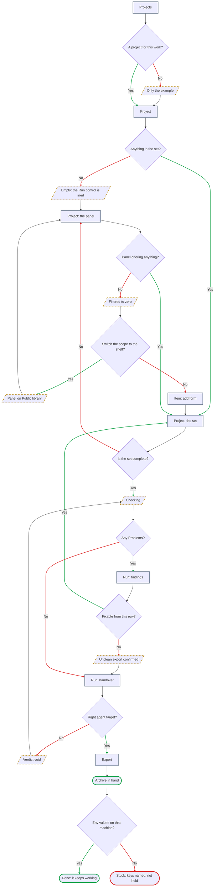
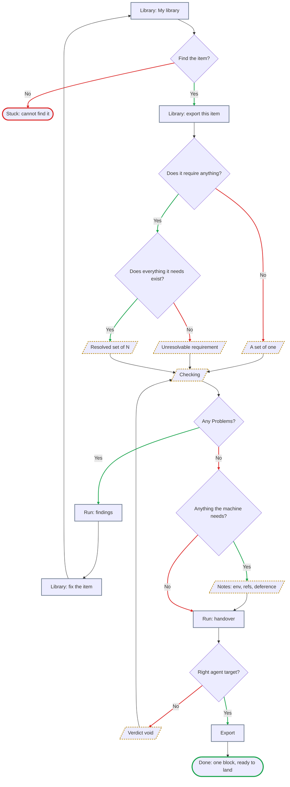
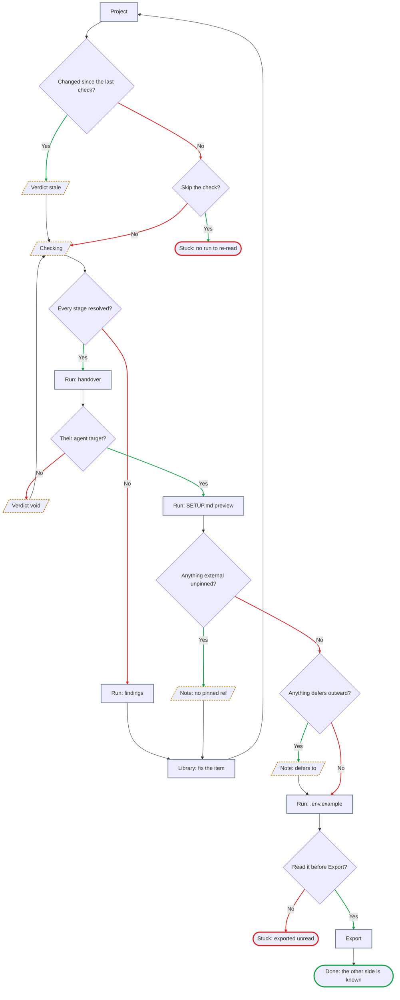
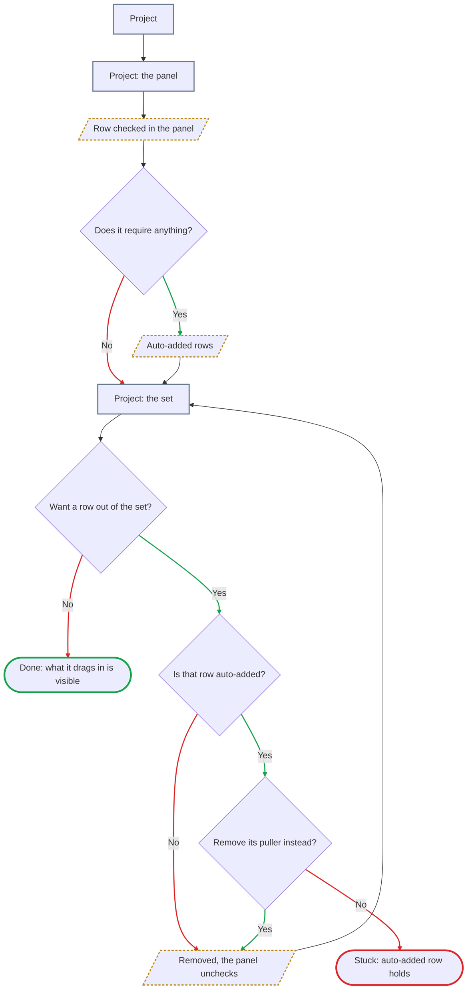
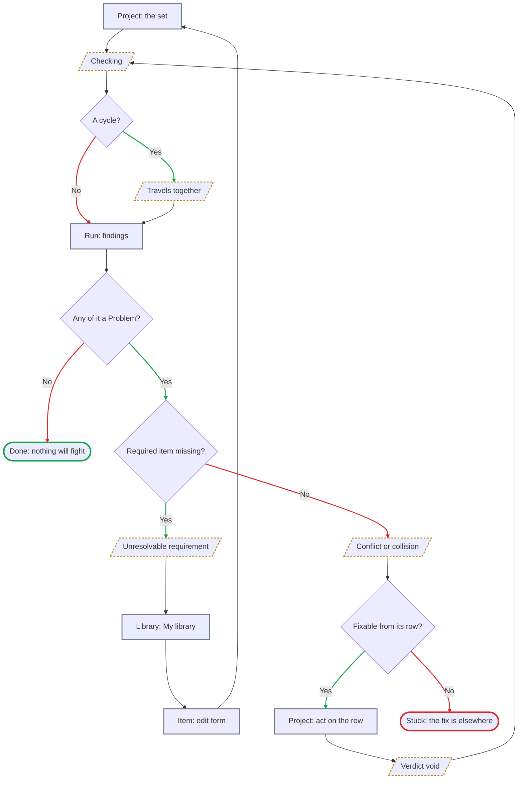
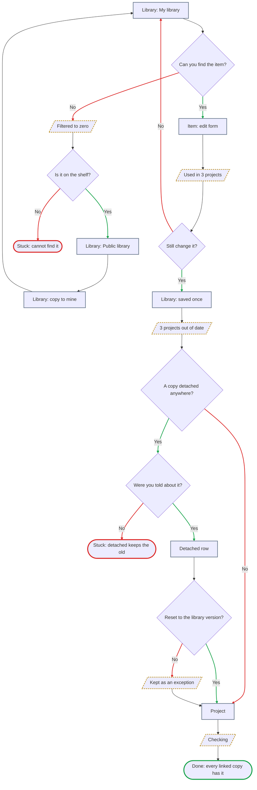
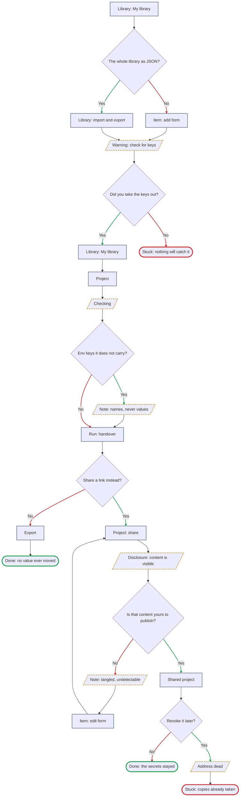

# User flows — lesson 03, information architecture

> **Written 2026-09-16, out of [`sitemap.md`](sitemap.md) and nothing else.** Every screen node in
> these diagrams is a screen, mode, overlay or state that section already established. **No new screen
> was invented, and none was needed** — which is the first thing the exercise was meant to test.
>
> **Six flows in seven diagrams** — the main job and four related ones, with **RJ-2 split in two**
> because one picture of it was too wide to read, plus **the single-item export**, added 2026-09-20
> with Q15. Each is drawn from
> [`jtbd.md`](../research/7-jobs-to-be-done/jtbd.md), named with the job's own wording rather than with
> a feature name, and each ends in **both** kinds of ending — the one where the person is done, and the
> ones where they are stuck.

**How to read the shapes.**

| Shape | Meaning |
|---|---|
| `[ rectangle ]` | **A screen, mode or overlay** — the name is the one [`sitemap.md`](sitemap.md) uses |
| `[/ parallelogram /]` | **A state** of one of those — empty, checking, filtered to zero, stale, void. Drawn with a **dashed amber outline** |
| `{ diamond }` | **A decision**, always a yes/no question. **The green branch is *yes*, the red branch is *no*** |
| `([ stadium ])` | **An ending**, outlined **green** for `Done:` and **red** for `Stuck:` |

**Node labels are names, not sentences.** *Corrected 2026-09-16: the first version carried labels of up
to 95 characters, which sprawls a `TD` flowchart sideways until it stops being readable.* **The diagram
carries the shape; the numbered list under it carries the argument.** Every node is keyed to a line in
that list.

**Checked by rendering, not by parsing, and in a browser.** *A parser validates the grammar and will
happily pass a diagram nobody can read.* Every diagram here was rendered at an **880-pixel column** —
roughly what a repository page gives it — and measured: **no node box overlaps another**, no label
overflows its shape, and **none is scaled below 0.74**, where text starts to disappear. Two things the
render caught that nothing else would: **`⌘` has no glyph in the default stack and drew as an empty
box**, so the adding mechanism is named in prose; and RJ-2 was **1608 units wide, squeezed to 54%**,
which is why it is now two diagrams.

**Re-measured 2026-09-20, after the revision below, in the same way — and measured again the same
evening**, when an independent review found the single-item flow stating a severity rule wrongly and it
had to gain a fork. Seven diagrams, **no overlap anywhere, nothing below 0.74**:

| # | Diagram | Nodes | Width | Scale at 880 |
|---|---|---|---|---|
| 1 | The main job | 27 | **1008** — *was 1074* | **0.855** — *was 0.803* |
| 2 | Single-item export — new | 20 | 942 | 0.915 |
| 3 | RJ-1 | 22 | 1164 | **0.741** — unchanged, and **the tightest in the file** |
| 4 | RJ-2a | 12 | 851 — *was 819* | 1.0 |
| 5 | RJ-2b | 16 | 1131 | 0.762 — unchanged |
| 6 | RJ-3 | 21 | 874 | 0.986 — unchanged |
| 7 | RJ-4 | 26 | 961 | 0.897 — unchanged |

**Two things in that table are worth reading rather than skipping.** **The main job got narrower and
legibler and *taller*** — 3202 rendered pixels became **3521**, on four fewer nodes. Removing a wide
side-branch makes a graph more linear, and a more linear `TD` graph grows downward. **So the owner's
open question — whether the main job should be split by height, along *assemble · check · hand over* —
is now sharper rather than answered**, and it is the only diagram in the file over 3,000 pixels.
**And RJ-1 sits at 0.741**, a thousandth above the floor this file set for itself; it was there before
this revision and nothing here moved it, but it is the next diagram to need splitting if anything is
ever added to it.

> **Revised 2026-09-20 against Q14–Q17.** The `⌘K` palette is gone and **the library panel** took its
> place, which **removed a branch rather than adding one** — the excursion out to `Library` and
> `Public library` and back is now a scope switch inside the Project. **An empty project no longer
> offers `Check`** (Q16), so the *empty archive* dead end is gone too. **A seventh diagram was added**
> for the single-item export (Q15). Everything else is as it was.

**Only outlines are coloured, never fills.** *Corrected 2026-09-16: the first version set dark fills and
light text, which reads as intended on a dark page and as a row of black boxes on a light one.* Nodes
keep the reader's own theme, and the shape plus the outline carry the meaning — which is the same rule
§10 sets for the product itself: **two real themes, and neither is an inversion of the other.**

**One thing the colours do not mean.** A red branch is not a failure and a green one is not a success —
*no* is often the right answer. The colour marks **which way the question was answered**, and the
ending nodes are where success and dead ends are distinguished.

---

## The main job — "when something I have already got working has to live somewhere else, I want it to keep working there"

[The main job](../research/7-jobs-to-be-done/jtbd.md#the-main-job) · **P1**, primary · `✓` + `*`, and
the loudest number in the evidence base sits inside it.

**27 nodes, 34 edges — four nodes and four edges shorter than it was on 2026-09-16**, and the shortening
is the finding. *Two branches were removed by Q14 and Q16 and none was added.*

**The decisions, in words.**

1. **A project for this work?** — the only fork at the top, and it is why `Projects` is the first screen
   on a first run rather than `Library` (§Navigation).
2. **Anything in the set?** — the state nobody designs for. ~~*And the one that produces the product's
   emptiest possible result.*~~ **No longer:** an empty project is an empty state and **the control that
   enters Run is inert** (Q16), so the branch where somebody checks nothing — and the *empty archive*
   dead end at the end of it — **is gone from this diagram.** *One control, not two: `Export` is Run's
   final stage, so it goes with Run rather than being greyed beside it.* The one action in the body
   points at the panel, which is already on the screen.
3. **Panel offering anything?** — ~~the palette~~ **the panel** is the only way the library reaches this
   screen (§8, Q14), so a panel with nothing in it is a wall and not an inconvenience. **What changed is
   what happens next.**
4. **Switch the scope to the shelf?** — **this one edge replaced three screens.** Until 2026-09-20 a
   palette that matched nothing sent the person to `Library`, made them discover it was empty, sent them
   on to `Public library` and back. **The panel carries both scopes, so the person does not leave the
   Project.** §11 still guarantees `My library` is empty on first run; what changed is the distance to
   the answer.
5. **The row that creates** — a zero result is not only a wall. The other way out is authoring the thing
   that was missing, which opens the add/edit overlay **over the Project**. It is the one moment
   assembly reaches the authoring surface, and it is honest: **creating is a corpus act, not an
   assembling one.**
6. **Is the set complete?** — the loop back into the panel, and where this product's real depth lives:
   **selection, not traversal.**
7. **Any Problems?** — three severities, and none of them blocks.
8. **Fixable from this row?** — §8 says a finding annotates the row that owns it. When the fix is four
   items away this is a *no*, and the unclean export is the honest route.
9. **Right agent target?** — changing it **voids the verdict** (§6), because a path collision is a
   collision *under a target*.
10. **Env values on that machine?** — the product's ceiling, drawn as a decision it does not get to
    make.

**The states, in words.** *Projects holding only the example* · *an empty project with its one primary
control inert* · *the panel filtered to zero* · *the panel switched to the shelf* · *the check in
progress* · *the unclean-export confirmation, in the row below the finding that caused it* · *the
verdict voided by a target change*.

**Where a person gets stuck — and there is now one place, not two.** ~~**The empty archive** — they
checked a set with nothing in it, got a column of neutral glyphs, and exported a zip that teaches
nothing.~~ **Removed by Q16**, and it was removed for the reason this diagram exposed: the person
pressing `Check` on an empty project was not making a mistake, they were **asking what the product
does**, and a column of grey glyphs is a poor answer to the only free question anybody asks.
**The env values on the other side** — the archive is correct, `.env.example` names the keys, and the
product has nothing to give them because `needsEnv` holds names and never values. That one stays, and
it is the main job's own ceiling: **checked, never works.**

---

## The single-item export — the main job at its smallest scale

**Added 2026-09-20 with [Q15](../research/research-plan.md).** Not a job of its own: it is
[the main job](../research/7-jobs-to-be-done/jtbd.md#the-main-job) performed on **one block**, from the
Library, with no project built around it — and, through the shelf, the nearest thing the product has to
[H-J4](../research/7-jobs-to-be-done/jtbd.md#6-hypotheses--the-jobs-that-did-not-earn-the-main-list) `[?]`.
**It is drawn because it is the first path that starts in the Library and ends in an archive**, and
because the thing it teaches — *what a check can and cannot find when there is only one item* — is
easy to state wrongly.

**The decisions, in words.**

1. **Find the item?** — the same H-J1 as RJ-3, importance **2**, and the thinnest evidence behind any
   screen in the product. **The dead end is the same one**, and it is reached here from a person who
   knows exactly what they want.
2. **Does it require anything?** — **the fork the whole answer turned on.** Shipping the bare file
   would hand somebody a block that does not run, which is the pain the product exists against. **So
   the walk runs**, and an item with `requires` leaves as a set of N **named as one**.
3. **Does everything it needs exist?** — *added 2026-09-20 after a review found the rule below stated
   wrongly.* A `requires` edge can point at something that is **no longer in the library**, because
   Q17 lets an item be deleted while others still require it. **That is an unresolvable requirement,
   and §6 lists it as a Problem** — raised by an item whose resolved set is only itself.
4. **Any Problems?** — and here is the part that is easy to get wrong, twice. **From *a set of one* the
   answer is always no**, not by luck but by construction: the other three Problems each need two items
   — a duplicate command name, a shared target path, a declared conflict — and nothing collides with
   itself. **From *a resolved set of N* it is an ordinary question.** **And from a dangling edge it is
   always yes.** So the rule is about the **field, not the count**: *a single item is always safe* is
   false, and so was the first correction of it — ***an item with an empty `requires` cannot produce a
   Problem*** is the form that survives. **The diagram reaches each of the three by rule rather than by
   accident, which is why the fork above it exists.**
5. **Anything the machine needs?** — `Notes` are item-level and survive alone: a missing env **name**,
   an unpinned `ref`, a deference. **This is the branch a single item actually uses.**
6. **Right agent target?** — it must still be chosen, because `targetPath` means nothing without one.
   **There is no project to remember it on** (E13), which is why step 3 cannot answer *where the target
   lives* with *on the project*.

**The states, in words.** *A set of one, where no Problem is possible* · *a resolved set of N* · *a
requirement pointing at something deleted* · *the check in progress* · *Notes naming what the receiving machine still needs* · *the verdict voided by a
target change*.

**What is not here, and it is deliberate. Nothing is stored.** §6 puts the verdict on the **project**,
and there is no project — so this run leaves **no `checkedAt`, no counts, no target**, exactly like a
visitor's run on a shared page. **The archive is the only thing that survives it.**

**Where a person gets stuck.** **The item they cannot find** — unchanged, and it is the one dead end
this flow has. Everything else loops: a Problem sends them to the Library to fix the item and back, and
a wrong target re-runs the check. **That is what a short flow looks like when nothing blocks and the
only irreversible step is the last one.**

---

## RJ-1 — "know what the other side will still need, before I send it"

[RJ-1](../research/7-jobs-to-be-done/jtbd.md#rj-1--know-what-the-other-side-will-still-need-before-i-send-it)
· **P1** sending, **P2** receiving · importance **`[?]`** for the primary — the cell was withdrawn by
the audit and hunted for twice since.

**The decisions, in words.**

1. **Changed since the last check?** — six events void a verdict (§6), and one of them is an edit to an
   item the person never touched because `requires` pulled it in.
2. **Skip the check?** — there is nothing to skip to: the verdict survives as counts and a date, the
   findings do not, and **the handover stages exist only inside a run.**
3. **Every stage resolved?** — findings come before the handover; an unresolvable requirement is read on
   the project, not in the disclosure.
4. **Their agent target?** — it selects the paths **and the reader**, since `SETUP.md` is addressed to
   an agent.
5. **Anything external unpinned?** — a Note, and the one the handover test proved load-bearing: the
   receiving agent used the pins to fetch back both items the archive had lost. Its fix and a finding's
   fix are **the same act** — go to the Library, edit the item, come back to a set that has changed —
   so the diagram gives them one return path rather than two.
6. **Anything defers outward?** — Q10's Note, carried to the receiver because **the receiver is the
   person whose linter it is going to be.**
7. **Read it before Export?** — the whole job in one question.

**The states, in words.** *A stale verdict naming what voided it* · *the check in progress* · *the
verdict voided by a target change* · *an external item with no pinned `ref`* · *a deference Note that
never clears*.

**Where a person gets stuck.** **Skipping the check** — because no run is stored, there is no page where
last week's handover can be re-read; re-reading means checking again, and a person who does not know
that will look for a link that does not exist. **Exporting unread** — the disclosure was placed before
the irreversible step precisely so this could not happen quietly, and the flow draws it as reachable
anyway, because nothing blocks.

---

## RJ-2 — "find out what my pieces drag in, and where two of them will fight, while I can still act"

[RJ-2](../research/7-jobs-to-be-done/jtbd.md#rj-2--find-out-what-my-pieces-drag-in-and-where-two-of-them-will-fight-while-i-can-still-act)
· **P1** · importance **3**, and `✓` that **nothing on the market has this object at all**: four skill
managers were run against a deliberately broken set and none saw a set-level defect.

**Two diagrams, because the job has two halves and one picture of it does not fit.** *Split
2026-09-16: as one graph it was 1608 units wide, which a normal column scales to 54% — legible in
nothing.* **2a is *what it drags in*. 2b is *where two of them fight*.**

**2a · What it drags in, and the one row that will not go**

**2b · Where two of them fight, while I can still act**

**The decisions, in words.** *Redrawn 2026-09-16, twice. First because the diagram mixed the two
moments — it asked about **check findings** on the Project screen, before and after the run, and every
Problem in §6 is produced by the check and nowhere else. Then split in two, because one graph of it was
too wide to read.*

**In 2a — what it drags in.**

1. **Does it require anything?** — the depth-first walk, run the moment the item is added. Auto-added
   rows appear on the Project screen **with no check involved**, each naming what pulled it in.
2. **Want a row out of the set?** — the removal branch, and the only place in the entire specification
   where the product refuses an action. **Since 2026-09-20 removal is an `✕` on the project row, and it
   unchecks the panel** (Q14): the row *is* the membership (E5), and the panel is a view of it, so the
   action lives where the fact does.
3. **Is that row auto-added?** and **remove its puller instead?** — the refusal has a shape worth
   drawing: **you do not remove the dependency, you remove what dragged it in.** **The panel inherits
   it rather than softening it** — a held row cannot be unchecked from either side, and **a checkbox
   that refuses to clear is the honest rendering of `addedBy: dependency`**, not a broken control.

**In 2b — where two of them fight.**

4. **A cycle?** — **not an error.** A project is a set and never an execution order, so the answer is
   *these three always travel together*, reported as information.
5. **Any of it a Problem?** — the only place the word appears, because **the check is the only thing
   that produces one.**
6. **Required item missing?** — an unresolvable requirement, whose fix leaves this flow entirely: you go
   and author the missing item, and come back to a set that has changed.
7. **Fixable from its row?** — §8 says a finding annotates its own row. When it can be acted on the set
   changes and **the verdict is void**, which is why the loop goes back **through** the check rather
   than around it.

**The states, in words.** *A row checked in the panel* · *auto-added rows naming what pulled them in* ·
*a row removed and its panel checkbox clearing with it* · *the check in progress* · *a cycle reported as information* · *an unresolvable
requirement* · *a declared conflict, a duplicate command name or a target-path collision* · *the verdict
voided because the set changed*.

**Where a person gets stuck.** **The auto-added row that will not go** — the product's one refusal, and
the dead end is real: if it does not occur to you to remove the puller instead, there is no other way
out. **The Problem you cannot reach from here** — the fix is four items away or in another project, and
the archive will carry only one of the two, which is correct behaviour and still a bad afternoon.

---

## RJ-3 — "fix something once and have the fix reach every copy of it"

[RJ-3](../research/7-jobs-to-be-done/jtbd.md#rj-3--fix-something-once-and-have-the-fix-reach-every-copy-of-it)
· **P1** · importance **3** · `✓` that copies drift and **stay** drifted: 14% of 7,506 duplicated items
out of sync now, 383 divergences open at a median of 121 days, four ever reconciled.

**The decisions, in words.**

1. **Can you find the item?** — H-J1, importance **2**, and the thinnest evidence behind any screen in
   the product.
2. **Is it on the shelf?** — the `Public library` scope is read-only: you copy it into `My library` and
   own the copy from then on, which is the only way to make it fixable.
3. **Still change it?** — the blast radius is disclosed **before any field is editable**, which is where
   it had to go once `Item` stayed a form rather than becoming a place.
4. **A copy detached anywhere?** — the exception `detached` and `overrides` exist for.
5. **Were you told about it?** — the honest question, and today's answer is **no**: the Library row does
   not say it. *Recorded open on E14 and E5 in [`sitemap.md`](sitemap.md).*
6. **Reset to the library version?** — a *no* is legitimate: the override was the point, and the row
   names the fields that differ.

**The states, in words.** *The Library filtered to zero* · *the blast radius at the head of the form* ·
*every holding project reading as out of date* · *a detached row kept deliberately, with its differing
fields named* · *the check in progress*.

**Where a person gets stuck.** **The item they cannot find** — nothing in this product prompts a review
of the corpus, which the practitioner on record says plainly: *"I basically never go in there to read or
review."* **The detached copy nobody mentioned** — the fix reaches every **linked** copy and by design
skips the detached one, and this flow is where that design decision becomes a person discovering it
weeks later. **It is the sharpest thing these five diagrams found.**

---

## RJ-4 — "move my work without moving my secrets or my client's business with it"

[RJ-4](../research/7-jobs-to-be-done/jtbd.md#rj-4--move-my-work-without-moving-my-secrets-or-my-clients-business-with-it)
· **P1** and **P2** · `✓`, the largest crowd on a fear after the multi-target family — 192, 54, 45, 32,
23, 22 across three trackers.

**The decisions, in words.**

1. **The whole library as JSON?** — both answers land on the same warning, which is the point: **the
   library has exactly one way in, so there is exactly one place to say this.** *Yes* is the orphan —
   §10 commits to JSON import and export and **no job raises it.**
2. **Did you take the keys out?** — **asked of the person, never answered by the product.** This is the
   decision that used to be a refusal and became a warning on 2026-09-16: detection was the part that
   could not be built, and a block standing on a scan we do not trust stops the file that was fine.
3. **Env keys it does not carry?** — a Note, and the strongest guarantee in the product sits under it:
   `needsEnv` holds **names and never values**, so there is structurally no value to leak.
4. **Share a link instead?** — the two exits, and until 2026-09-16 only one of them was ever going to be
   checked.
5. **Is that content yours to publish?** — the tangled case a practitioner actually described: a
   client's internal API shape in an example, a rule naming a client, an env key whose own **name**
   names a customer. **We cannot detect these and must not pretend to.**
6. **Revoke it later?** — a real branch with an ending that is not a success.

**The states, in words.** *The warning where material comes in* · *the check in progress* · *missing env
names as a Note* · *the sharing disclosure* · *the tangled-content Note* · *a revoked address*.

**Where a person gets stuck.** **The key they left in** — nothing in this product will catch it, and the
flow says so out loud rather than drawing a scanner that does not exist. **The link they revoked** — the
address dies and every copy already taken lives on, which the product must state **at the moment of
revoking** rather than implying a recall.

---

## What these flows did to the sitemap

**Nothing, and that is the result worth recording.** Every node above is a screen, mode, overlay, region
or state that [`sitemap.md`](sitemap.md) had already established — **no new screen appeared, in six
flows covering the main job, four related ones and the single-item export.** An information architecture
that needs a new place the moment somebody walks a real path through it is an architecture that was
drawn from a product rather than from jobs.

**And it held through a change of mechanism, which is the harder test** (2026-09-20, Q14). The way the
corpus reaches the builder was replaced outright — an overlay summoned by a keystroke became a region of
the screen — **and the place count did not move.** What moved was the opposite of what a reader would
expect: **the main job lost four nodes and four edges**, because the panel absorbed an excursion to two
other screens and Q16 removed a branch that ended in a wasted archive. **This is the first revision in
which decisions subtracted from these diagrams.**

**Three things the flows surfaced that the static map did not, and each is a consequence rather than a
gap.**

1. **The detached copy nobody is told about** (RJ-3). *Fix it once and have the fix reach every copy* is
   importance **3**, and a detached row is **by design** not reached. The Library row that says *used in
   3 projects* does not say *and one of them will not get this.* **The mechanism is correct and the
   disclosure is missing**, which is a step 5 question about what the form's head says, not a change to
   §5.
2. **The empty set that checks clean** (main job). A project with no members produces a column of
   Skipped and an archive containing nothing. §6 gave *Skipped* its own neutral glyph for exactly this
   honesty, and the flow shows the one path where neutral glyphs all the way down is still a wasted
   afternoon.
3. **Two of the dead ends are outside the product** (the env values on the receiving machine, the
   revoked link's copies). **Neither is a defect and neither can be designed away** — they are the shape
   of *checked, never works* and of *revoking recalls nothing*, drawn so that step 5 writes sentences
   for them instead of discovering them.

**What the 2026-09-20 revision changed in that list.** Finding 2 — **the empty set that checks clean** —
**is answered rather than outstanding**: `Check` and `Export` are inert on an empty project (Q16), so
the path no longer exists. **The reasoning behind it does not go away and is worth keeping in view**:
`0 problems · 0 notes` still reads the same on an empty set and a perfect one, and that is a property of
**counts as a verdict**, not of the empty project. It is recorded open in the register under Q16.
Finding 1 — **the detached copy nobody is told about** — **got worse rather than better**: the same
count is now read in a **third** place, the delete confirmation (Q17), where it errs in the **opposite**
direction, overstating the damage where an edit understated the reach. See `sitemap.md`,
*2026-09-20 — the panel, and what it moved*.

**One path is deliberately not drawn: deleting an item from the library** (Q17). It is a confirmation
with two outcomes and no branching of consequence, and drawing it would add a diagram that teaches
nothing these six do not. **What makes it worth naming rather than omitting** is the question it leaves
open — *what happens to a detached row whose original is deleted* — which has no answer in §5 and
therefore no honest node. **When it is answered, this is the flow to draw.**
