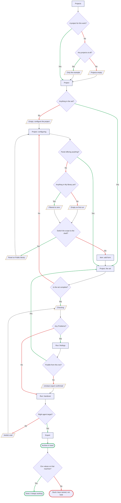
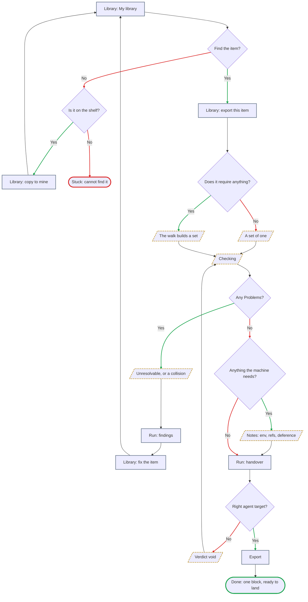
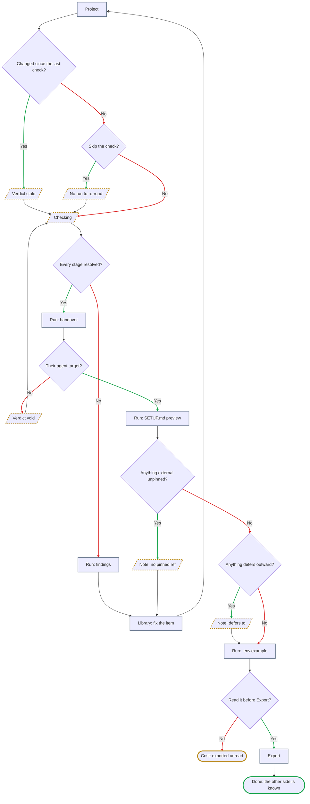
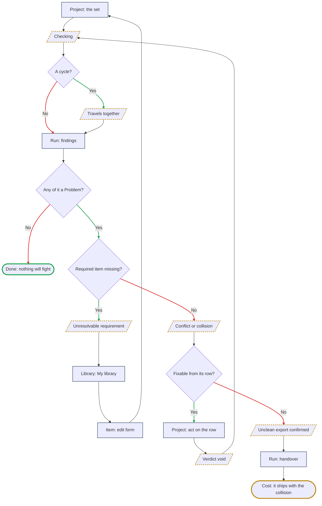
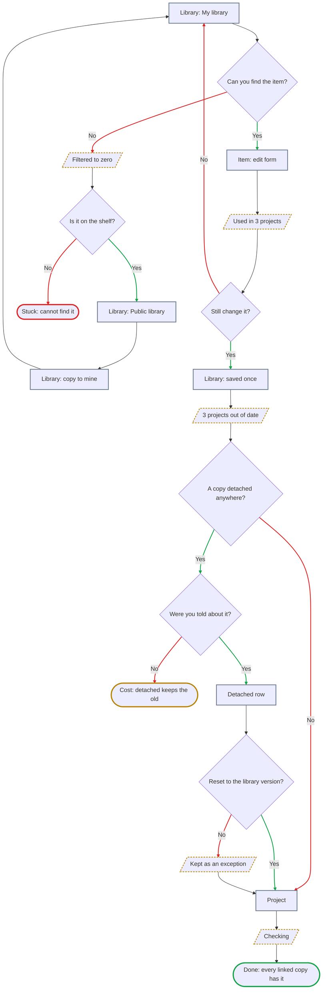
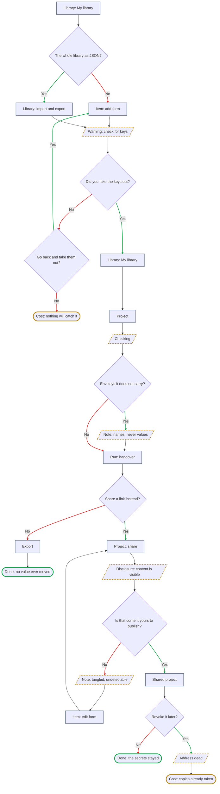
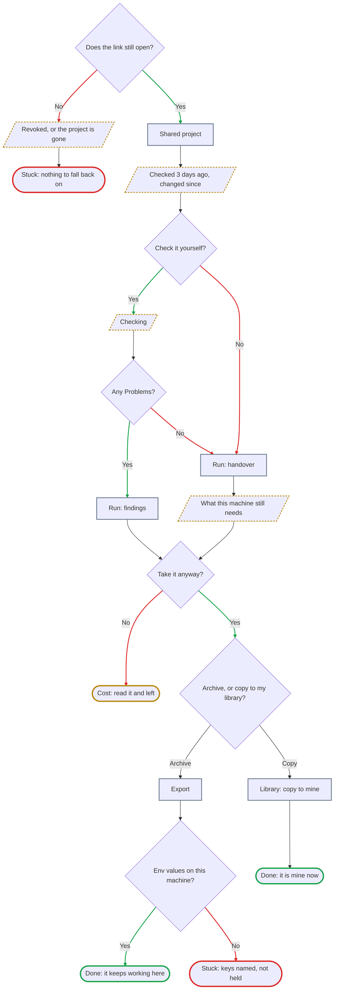

# User flows — lesson 03, information architecture

> **Written 2026-09-16, out of [`sitemap.md`](sitemap.md) and nothing else.** Every screen node in
> these diagrams is a screen, mode, overlay or state that section already established. **No new screen
> was invented, and none was needed** — which is the first thing the exercise was meant to test.
>
> **Seven flows in eight diagrams** — the main job and four related ones, with **RJ-2 split in two**
> because one picture of it was too wide to read; **the single-item export**, added 2026-09-20 with
> Q15; and **the receiver's path**, added the same day by [the critique](ia-critique.md), which found
> that the surface carrying the most jobs in the product had never been walked. Each is drawn from
> [`jtbd.md`](../research/7-jobs-to-be-done/jtbd.md), named with the job's own wording rather than with
> a feature name, and each ends in **both** kinds of ending — the one where the person is done, and the
> ones where they are stuck.

**How to read the shapes.**

| Shape | Meaning |
|---|---|
| `[ rectangle ]` | **A screen, mode or overlay** — the name is the one [`sitemap.md`](sitemap.md) uses |
| `[/ parallelogram /]` | **A state** of one of those — empty, checking, filtered to zero, stale, void. Drawn with a **dashed amber outline** |
| `{ diamond }` | **A decision**, always a yes/no question. **The green branch is *yes*, the red branch is *no*** |
| `([ stadium ])` | **An ending**, in three kinds — see below |

**Three kinds of ending, and the third was added 2026-09-20.** *The file shipped with two and the
critique found endings that were neither.*

| Outline | Means | Test |
|---|---|---|
| **Green** · `Done:` | The job closed | The person got what they came for |
| **Amber** · `Cost:` | **The job did not close, and nothing stopped them** | They proceeded, knowingly or not, and paid for it |
| **Red** · `Stuck:` | The person cannot proceed | There is no action left that the product offers |

**Why the third was needed.** *Exported unread* was drawn red beside *cannot find it*, which flattened
the distinction this product spends §6 building: **a cost you were told about is not an obstruction.**
Applying the test moved four endings out of red and **left three genuine `Stuck:` in the whole file** —
the auto-added row that will not go, the item that is nowhere, and the dead link. **Two of the three
are outside our reach and one is the product's only refusal**, which is what *nothing blocks* looks
like when it is drawn rather than asserted.

**Two flows have no `Stuck:` at all — RJ-1 and RJ-2b — and that is a result, not a gap.** They are the
flows about **findings**, and a finding never blocks anybody. *The rule this file used to state — every
flow ends in both kinds — was written when the diagrams had dead ends they should not have had.*

**Waits and failures are named in words under each flow, and deliberately not drawn.** *Added
2026-09-20 after [the critique](ia-critique.md) found no `loading` node and only one `error` node in
eight diagrams.* **Both classes are real** — the product is online (Q24), so every read and write
crosses a network — **and putting them in the diagrams would have doubled every graph to say the same
thing eight times.** §2 already calls the validation pass *a designed moment, not a spinner*, which
leaves open what ordinary waiting looks like; **that is a composition decision and it belongs to lesson
04.** So each flow carries a short list instead, and **the diagrams stay about what the person is
deciding.**

**Two failures belong to every path, so they are named once here rather than eight times.**

**A session that expires mid-work — answered 2026-09-20, Q25.** **You return to where you were, nothing
is re-run, and nothing saved is lost** — and because configuring and `Run` are **modes**, you return to
**the place**, not into the act. *You were halfway through assembling a set* is **not** something this
architecture can restore, and it does not pretend to. **The shape is borrowed rather than invented**:
§Navigation already rules that a reload during a check returns to the Project and does not silently
start a new one, *because a re-run is a choice nobody made* — EJ-1, importance 3.

**A second tab on the same account.** Sync means one person can now disagree with themselves — edit an
item in one window while exporting it in another. **Single user has stopped meaning single writer**,
and nothing in §5, §6 or the sitemap has noticed.

**Node labels are names, not sentences.** *Corrected 2026-09-16: the first version carried labels of up
to 95 characters, which sprawls a `TD` flowchart sideways until it stops being readable.* **The diagram
carries the shape; the numbered list under it carries the argument.** Every node is keyed to a line in
that list.

**Checked by rendering, not by parsing, and in a browser.** *A parser validates the grammar and will
happily pass a diagram nobody can read.* Every diagram here was rendered at an **880-pixel column** —
roughly what a repository page gives it — and measured: **no node box overlaps another**, no label
overflows its shape, and **none is scaled below 0.74**, where text starts to disappear. Two things the
render caught that nothing else would: **`⌘` has no glyph in the default stack and drew as an empty
box**, so the adding mechanism is named in prose; and RJ-2 was **1608 units wide, squeezed to 54%**,
which is why it is now two diagrams.

**Measured three times on 2026-09-20** — after the panel revision, after a review forced a fork into
the single-item flow, and after [the critique](ia-critique.md) added a diagram and reshaped four.
**Eight diagrams, no overlap anywhere, no parse errors:**

| # | Diagram | Nodes | Width | Scale at 880 | Height |
|---|---|---|---|---|---|
| 1 | The main job | 31 | 1154 | 0.747 | **3528** |
| 2 | Single-item export | 21 | 1205 | **0.716** | 1651 |
| 3 | RJ-1 | 22 | 1157 | 0.745 | 2210 |
| 4 | RJ-2a | 12 | 851 | **1.0** | 1806 |
| 5 | RJ-2b | 18 | 1165 | 0.740 | 1323 |
| 6 | RJ-3 | 21 | 874 | 0.986 | 2610 |
| 7 | RJ-4 | 27 | 957 | 0.901 | 3022 |
| 8 | The receiver — new | 20 | 836 | **1.0** | 2441 |

**The floor was wrong and rendering is what caught it.** *This file set itself two numbers — keep under
about 900 units wide, nothing scaled below 0.74 — and the single-item flow broke both at 1205 and
0.716.* **So it was rendered on its own and looked at**, which is this file's actual rule, and **every
label reads without effort.** The reason is visible the moment you look: **its width is empty space
generated by two back edges**, not density. *A wide sparse graph and a wide crowded one score the same
and read nothing alike.*

**So the numbers are demoted to what they always were — a screen, not a verdict.** `0.74` came from one
observation (RJ-2 at 0.54 was mush) and `900 units` from another (RJ-3 at 874 read perfectly).
**Neither was ever measured against a case in between.** **The rule, restated: a diagram under 0.74 or
over about 1,100 units is rendered alone and looked at before it is accepted or split** — which is what
happened here, and what would have happened anyway, because a parser was never going to settle it.

**And the height question got worse, not better.** The main job is **3,528 pixels** on 31 nodes, and it
is still the only diagram over 3,000. **The owner's open question — split it along *assemble · check ·
hand over* — is the one thing in this file that three revisions have made more pressing and none has
touched.**

> **Revised 2026-09-20 against Q14–Q17.** The `⌘K` palette is gone and **the library panel** took its
> place, which **removed a branch rather than adding one** — the excursion out to `Library` and
> `Public library` and back is now a scope switch inside the Project. **An empty project no longer
> offers `Check`** (Q16), so the *empty archive* dead end is gone too. **A seventh diagram was added**
> for the single-item export (Q15). Everything else is as it was.

**Only outlines are coloured, never fills.** *Corrected 2026-09-16: the first version set dark fills and
light text, which reads as intended on a dark page and as a row of black boxes on a light one.* Nodes
keep the reader's own theme, and the shape plus the outline carry the meaning — which is the same rule
§10 sets for the product itself: **two real themes, and neither is an inversion of the other.**

**One thing the colours do not mean.** A red branch is not a failure and a green one is not a success —
*no* is often the right answer. The colour marks **which way the question was answered**, and the
ending nodes are where success and dead ends are distinguished.

---

## The main job — "when something I have already got working has to live somewhere else, I want it to keep working there"

[The main job](../research/7-jobs-to-be-done/jtbd.md#the-main-job) · **P1**, primary · `✓` + `*`, and
the loudest number in the evidence base sits inside it.

**31 nodes, 40 edges.** *It was 31 and 38 on 2026-09-16, fell to 27 and 34 when Q14 and Q16 removed two
branches, and came back up when the critique restored two states that had gone missing — one of them
removed by my own fix that morning.* **The shape is not what it was: four fewer nodes of route, four
more of state.**

**The decisions, in words.**

1. **A project for this work?** — the only fork at the top, and it is why `Projects` is the first screen
   on a first run rather than `Library` (§Navigation).
2. **Any projects at all?** — *added 2026-09-20 by the critique.* §11's example project is
   **deletable**, so *no projects at all* is reachable and was drawn nowhere. It is the emptiest surface
   the owner can produce and **the only one with no shelf to fall back on.**
3. **Anything in the set?** — the state nobody designs for. ~~*And the one that produces the product's
   emptiest possible result.*~~ **No longer:** an empty project is an empty state and **the control that
   enters Run is inert** (Q16), so the branch where somebody checks nothing — and the *empty archive*
   dead end at the end of it — **is gone from this diagram.** *One control, not two: `Export` is Run's
   final stage, so it goes with Run rather than being greyed beside it.*
   **The node names what the state offers rather than what is dead in it** — *corrected 2026-09-20 in
   the owner's review, where it read `Empty: Check and Export inert` and named only the greyed control.*
   **The one action enters the configuring mode**, which is the next node and the only place items come
   from.
4. **Configuring, and the panel offering anything?** — **the Project screen has two modes** (Q14,
   amended 2026-09-20): *viewing* the set, and *configuring* it. **The panel exists only in the
   second**, and so does the `✕` that takes a row out — *a row being read is not a row being changed.*
   The panel is the only way the library reaches this screen (§8), so a panel with nothing in it is a
   wall and not an inconvenience. **What changed is what happens next.**
   **The one thing this costs is a click, and it is counted**: path B in `sitemap.md` §Navigation is
   **four**, not three, because a new project's one action is the entry into this mode.
5. **Anything in My library yet?** — *restored 2026-09-20, and it is a regression the critique caught.*
   §11 guarantees that room is **empty on first run**, and removing the palette excursion that morning
   took the state out of every diagram along with the detour. **The detour deserved to die; the fact did
   not.** It now sits where it belongs, on the panel.
6. **Switch the scope to the shelf?** — **this one edge replaced three screens.** Until 2026-09-20 a
   palette that matched nothing sent the person to `Library`, made them discover it was empty, sent them
   on to `Public library` and back. **The panel carries both scopes, so the person does not leave the
   Project.** §11 still guarantees `My library` is empty on first run; what changed is the distance to
   the answer.
7. **The row that creates** — a zero result is not only a wall. The other way out is authoring the thing
   that was missing, which opens the add/edit overlay **over the Project**. It is the one moment
   assembly reaches the authoring surface, and it is honest: **creating is a corpus act, not an
   assembling one.**
8. **Is the set complete?** — the loop back into **configuring**, and where this product's real depth
   lives: **selection, not traversal.** *The loop re-enters a mode of the same place; it goes nowhere.*
9. **Any Problems?** — three severities, and none of them blocks.
10. **Fixable from this row?** — §8 says a finding annotates the row that owns it. When the fix is four
   items away this is a *no*, and the unclean export is the honest route.
11. **Right agent target?** — changing it **voids the verdict** (§6), because a path collision is a
   collision *under a target*.
12. **Env values on that machine?** — the product's ceiling, drawn as a decision it does not get to
    make.

**The states, in words.** *Projects with nothing in it* · *Projects holding only the example* · *an
empty project offering one action, with its one primary control inert* · *`My library` empty on first
run* · *the panel filtered to zero* · *the panel switched to the shelf* · *the check in
progress* · *the unclean-export confirmation, in the row below the finding that caused it* · *the
verdict voided by a target change*.

**Where a person gets stuck — and there is now one place, not two.** ~~**The empty archive** — they
checked a set with nothing in it, got a column of neutral glyphs, and exported a zip that teaches
nothing.~~ **Removed by Q16**, and it was removed for the reason this diagram exposed: the person
pressing `Check` on an empty project was not making a mistake, they were **asking what the product
does**, and a column of grey glyphs is a poor answer to the only free question anybody asks.
**The env values on the other side** — the archive is correct, `.env.example` names the keys, and the
product has nothing to give them because `needsEnv` holds names and never values. That one stays, and
it is the main job's own ceiling: **checked, never works.**

**Waits and failures on this path — named, not drawn.** *`Checking` is the only wait with a node,
because §6 makes it a designed moment; everything below is a wait the product has never described.*

- **Waits.** The `Projects` list on arrival · **opening a project** — the set plus every row's state ·
  **the panel's first fill**, which needs the resolved set before it can order `Related` · filtering as
  you type · **saving a new item** from the add form · **building the archive** at Export.
- **The wait nobody has noticed.** **The dependency walk runs on the server now**, so *auto-added rows
  appear with no check involved* hides a round trip **in the middle of the busiest interaction in the
  product.** If it is slow, the panel's checkbox and the set disagree for as long as it takes.
- **Failures.** Creating the project · the panel cannot load the corpus · an add that does not persist ·
  an item that fails to save · **an export that fails to build**, which is the one that costs the most,
  because it is the last step and the person has already read the handover.

---

## The single-item export — the main job at its smallest scale

**Added 2026-09-20 with [Q15](../research/research-plan.md).** Not a job of its own: it is
[the main job](../research/7-jobs-to-be-done/jtbd.md#the-main-job) performed on **one block**, from the
Library, with no project built around it — and, through the shelf, the nearest thing the product has to
[H-J4](../research/7-jobs-to-be-done/jtbd.md#6-hypotheses--the-jobs-that-did-not-earn-the-main-list) `[?]`.
**It is drawn because it is the first path that starts in the Library and ends in an archive**, and
because the thing it teaches — *what a check can and cannot find when there is only one item* — is
easy to state wrongly.

**The decisions, in words.**

1. **Find the item?** — the same H-J1 as RJ-3, importance **2**, and the thinnest evidence behind any
   screen in the product. **The dead end is the same one**, and it is reached here from a person who
   knows exactly what they want.
2. **Does it require anything?** — **the fork the whole answer turned on.** Shipping the bare file
   would hand somebody a block that does not run, which is the pain the product exists against. **So
   the walk runs**, and an item with `requires` leaves as a set of N **named as one**.
3. **Any Problems? → *unresolvable, or a collision*** — *the fork was added 2026-09-20 after a review
   found the rule below stated wrongly, and moved below the check the same evening because that is
   where it belongs.* A `requires` edge can point at something **no longer in the library**, because
   Q17 lets an item be deleted while others still require it — **and nobody knows that until the walk
   runs.** The product does not ask *does everything exist*; **the check finds out.** Either way it is
   an unresolvable requirement and §6 lists it as a Problem, **raised by an item whose resolved set is
   only itself.**
4. **Any Problems?** — and here is the part that is easy to get wrong, twice. **From *a set of one* the
   answer is always no**, not by luck but by construction: the other three Problems each need two items
   — a duplicate command name, a shared target path, a declared conflict — and nothing collides with
   itself. **From *a resolved set of N* it is an ordinary question.** **And from a dangling edge it is
   always yes.** So the rule is about the **field, not the count**: *a single item is always safe* is
   false, and so was the first correction of it — ***an item with an empty `requires` cannot produce a
   Problem*** is the form that survives. **The diagram reaches each of the three by rule rather than by
   accident, which is why the fork above it exists.**
5. **Anything the machine needs?** — `Notes` are item-level and survive alone: a missing env **name**,
   an unpinned `ref`, a deference. **This is the branch a single item actually uses.**
6. **Right agent target?** — it must still be chosen, because `targetPath` means nothing without one.
   **There is no project to remember it on** (E13), which is why step 3 cannot answer *where the target
   lives* with *on the project*.

**The states, in words.** *A set of one, where a collision is impossible* · *the set the walk built* ·
*the check in progress* · *an unresolvable requirement, or a collision between two things it dragged
in* · *Notes naming what the receiving machine still needs* · *the verdict voided by a
target change*.

**What is not here, and it is deliberate. Nothing is stored.** §6 puts the verdict on the **project**,
and there is no project — so this run leaves **no `checkedAt`, no counts, no target**, exactly like a
visitor's run on a shared page. **The archive is the only thing that survives it.**

**Where a person gets stuck.** **The item they cannot find** — unchanged, and it is the one dead end
this flow has. Everything else loops: a Problem sends them to the Library to fix the item and back, and
a wrong target re-runs the check. **That is what a short flow looks like when nothing blocks and the
only irreversible step is the last one.**

**Waits and failures on this path — named, not drawn.**

- **Waits.** The library list · the filter · **the walk**, which is a server read even for one item ·
  the archive build.
- **Failures.** The copy from the shelf does not land · the walk fails · the export fails.
- **And one that is new since Q24 and belongs to no single flow.** **The product is online with
  accounts, so the same person can have two tabs open**, and the item being exported here may have been
  edited or deleted in the other one. **Nothing in this architecture has a word for that yet.**

---

## RJ-1 — "know what the other side will still need, before I send it"

[RJ-1](../research/7-jobs-to-be-done/jtbd.md#rj-1--know-what-the-other-side-will-still-need-before-i-send-it)
· **P1** sending, **P2** receiving · importance **`[?]`** for the primary — the cell was withdrawn by
the audit and hunted for twice since.

**The decisions, in words.**

1. **Changed since the last check?** — six events void a verdict (§6), and one of them is an edit to an
   item the person never touched because `requires` pulled it in.
2. **Skip the check?** — there is nothing to skip to: the verdict survives as counts and a date, the
   findings do not, and **the handover stages exist only inside a run.**
3. **Every stage resolved?** — findings come before the handover; an unresolvable requirement is read on
   the project, not in the disclosure.
4. **Their agent target?** — it selects the paths **and the reader**, since `SETUP.md` is addressed to
   an agent.
5. **Anything external unpinned?** — a Note, and the one the handover test proved load-bearing: the
   receiving agent used the pins to fetch back both items the archive had lost. Its fix and a finding's
   fix are **the same act** — go to the Library, edit the item, come back to a set that has changed —
   so the diagram gives them one return path rather than two.
6. **Anything defers outward?** — Q10's Note, carried to the receiver because **the receiver is the
   person whose linter it is going to be.**
7. **Read it before Export?** — the whole job in one question.

**The states, in words.** *A stale verdict naming what voided it* · *the check in progress* · *the
verdict voided by a target change* · *an external item with no pinned `ref`* · *a deference Note that
never clears*.

**Where a person gets stuck.** **Skipping the check** — because no run is stored, there is no page where
last week's handover can be re-read; re-reading means checking again, and a person who does not know
that will look for a link that does not exist. **Exporting unread** — the disclosure was placed before
the irreversible step precisely so this could not happen quietly, and the flow draws it as reachable
anyway, because nothing blocks.

**Waits and failures on this path — named, not drawn.**

- **Waits.** The project · the check · **the `SETUP.md` preview**, which is generated rather than
  stored · `.env.example` · the archive.
- **Failures.** The check cannot run · **the preview fails to generate**, which matters more than it
  looks: the preview *is* the disclosure this whole job is about, so a failure here is not a cosmetic
  one — it is the job silently not happening · the export fails.
- **Note the asymmetry.** A failed check is recoverable by pressing again. **A failed preview looks
  like a page with less on it**, and nothing tells the person that what they are reading is short
  because something broke.

---

## RJ-2 — "find out what my pieces drag in, and where two of them will fight, while I can still act"

[RJ-2](../research/7-jobs-to-be-done/jtbd.md#rj-2--find-out-what-my-pieces-drag-in-and-where-two-of-them-will-fight-while-i-can-still-act)
· **P1** · importance **3**, and `✓` that **nothing on the market has this object at all**: four skill
managers were run against a deliberately broken set and none saw a set-level defect.

**Two diagrams, because the job has two halves and one picture of it does not fit.** *Split
2026-09-16: as one graph it was 1608 units wide, which a normal column scales to 54% — legible in
nothing.* **2a is *what it drags in*. 2b is *where two of them fight*.**

**2a · What it drags in, and the one row that will not go**

**2b · Where two of them fight, while I can still act**

**The decisions, in words.** *Redrawn 2026-09-16, twice. First because the diagram mixed the two
moments — it asked about **check findings** on the Project screen, before and after the run, and every
Problem in §6 is produced by the check and nowhere else. Then split in two, because one graph of it was
too wide to read.*

**In 2a — what it drags in.**

1. **Does it require anything?** — the depth-first walk, run the moment the item is added. Auto-added
   rows appear on the Project screen **with no check involved**, each naming what pulled it in.
   **The first node is the configuring mode** (Q14, amended 2026-09-20): the set is changed there and
   nowhere else, so this whole flow happens inside one mode of one place.
2. **Want a row out of the set?** — the removal branch, and the only place in the entire specification
   where the product refuses an action. **Since 2026-09-20 removal is an `✕` on the project row, and it
   unchecks the panel** (Q14): the row *is* the membership (E5), and the panel is a view of it, so the
   action lives where the fact does.
3. **Is that row auto-added?** and **remove its puller instead?** — the refusal has a shape worth
   drawing: **you do not remove the dependency, you remove what dragged it in.** **The panel inherits
   it rather than softening it** — a held row cannot be unchecked from either side, and **a checkbox
   that refuses to clear is the honest rendering of `addedBy: dependency`**, not a broken control.

**In 2b — where two of them fight.**

4. **A cycle?** — **not an error.** A project is a set and never an execution order, so the answer is
   *these three always travel together*, reported as information.
5. **Any of it a Problem?** — the only place the word appears, because **the check is the only thing
   that produces one.**
6. **Required item missing?** — an unresolvable requirement, whose fix leaves this flow entirely: you go
   and author the missing item, and come back to a set that has changed.
7. **Fixable from its row?** — §8 says a finding annotates its own row. When it can be acted on the set
   changes and **the verdict is void**, which is why the loop goes back **through** the check rather
   than around it.

**The states, in words.** *A row checked in the panel* · *auto-added rows naming what pulled them in* ·
*a row removed and its panel checkbox clearing with it* · *the check in progress* · *a cycle reported as information* · *an unresolvable
requirement* · *a declared conflict, a duplicate command name or a target-path collision* · *the verdict
voided because the set changed*.

**Where a person gets stuck.** **The auto-added row that will not go** — the product's one refusal, and
the dead end is real. **It is also the only dead end in the product that our own rule creates**, which
[the critique](ia-critique.md) asked to have marked: every other `Stuck:` in this file is either a
machine we never touch or a thing that is simply not there. **So this is the one to re-test whenever
*nothing blocks* is restated**, and the reason it survives is that the branch before it offers the way
out — you remove what dragged it in. The dead end is what declining that offer looks like: if it does not occur to you to remove the puller instead, there is no other way
out. **The Problem you cannot reach from here** — the fix is four items away or in another project, and
the archive will carry only one of the two, which is correct behaviour and still a bad afternoon.

**Waits and failures on these two paths — named, not drawn.**

- **2a, waits.** The panel · **the dependency walk after every add**, which is the one that matters:
  the auto-added rows are the whole point of this half, and they arrive from a server.
- **2a, failures.** The add does not persist · the walk fails and the set is silently under-resolved ·
  **the `✕` does not persist**, so a row the person removed comes back on reload.
- **2b, waits.** The check, and **the check again after every fix** — this is the loop the product runs
  most often, so its wait is the one felt most.
- **2b, failures.** The check fails · the fix in the Library does not save · the row action does not
  persist. **In all three the verdict is the casualty**: §6 voids it on any change, so a change that
  half-happened leaves a project whose verdict is void for a reason nobody can name.

---

## RJ-3 — "fix something once and have the fix reach every copy of it"

[RJ-3](../research/7-jobs-to-be-done/jtbd.md#rj-3--fix-something-once-and-have-the-fix-reach-every-copy-of-it)
· **P1** · importance **3** · `✓` that copies drift and **stay** drifted: 14% of 7,506 duplicated items
out of sync now, 383 divergences open at a median of 121 days, four ever reconciled.

**The decisions, in words.**

1. **Can you find the item?** — H-J1, importance **2**, and the thinnest evidence behind any screen in
   the product.
2. **Is it on the shelf?** — the `Public library` scope is read-only: you copy it into `My library` and
   own the copy from then on, which is the only way to make it fixable.
3. **Still change it?** — the blast radius is disclosed **before any field is editable**, which is where
   it had to go once `Item` stayed a form rather than becoming a place.
4. **A copy detached anywhere?** — the exception `detached` and `overrides` exist for.
5. **Were you told about it?** — the honest question, and today's answer is **no**: the Library row does
   not say it. *Recorded open on E14 and E5 in [`sitemap.md`](sitemap.md).*
6. **Reset to the library version?** — a *no* is legitimate: the override was the point, and the row
   names the fields that differ.

**The states, in words.** *The Library filtered to zero* · *the blast radius at the head of the form* ·
*every holding project reading as out of date* · *a detached row kept deliberately, with its differing
fields named* · *the check in progress*.

**Where a person gets stuck.** **The item they cannot find** — nothing in this product prompts a review
of the corpus, which the practitioner on record says plainly: *"I basically never go in there to read or
review."* **The detached copy nobody mentioned** — the fix reaches every **linked** copy and by design
skips the detached one, and this flow is where that design decision becomes a person discovering it
weeks later. **It is the sharpest thing these five diagrams found.**

**Waits and failures on this path — named, not drawn.**

- **Waits.** The library · **the usage facts**, which are computed rather than stored — *used in 3
  projects* is a read, and it is read at the head of the form where the person is waiting to be allowed
  to type · the save · the copy from the shelf.
- **The failure that matters most in the product.** **A save that does not land after the blast radius
  was shown.** The person was told *saving un-checks 3 projects*, pressed save, and nothing came back.
  **Did it un-check them or not?** §6 voids a verdict on an edit, so the answer decides what three other
  projects now say about themselves, **and the person has no way to find out from this screen.**
- **Failures.** The save · the delete · **a concurrent edit from the person's other tab**, which Q24
  made possible and nothing has addressed.

---

## RJ-4 — "move my work without moving my secrets or my client's business with it"

[RJ-4](../research/7-jobs-to-be-done/jtbd.md#rj-4--move-my-work-without-moving-my-secrets-or-my-clients-business-with-it)
· **P1** and **P2** · `✓`, the largest crowd on a fear after the multi-target family — 192, 54, 45, 32,
23, 22 across three trackers.

**The decisions, in words.**

1. **The whole library as JSON?** — both answers land on the same warning, which is the point: **the
   library has exactly one way in, so there is exactly one place to say this.** *Yes* is the orphan —
   §10 commits to JSON import and export and **no job raises it.**
2. **Did you take the keys out?** — **asked of the person, never answered by the product.** This is the
   decision that used to be a refusal and became a warning on 2026-09-16: detection was the part that
   could not be built, and a block standing on a scan we do not trust stops the file that was fine.
3. **Env keys it does not carry?** — a Note, and the strongest guarantee in the product sits under it:
   `needsEnv` holds **names and never values**, so there is structurally no value to leak.
4. **Share a link instead?** — the two exits, and until 2026-09-16 only one of them was ever going to be
   checked.
5. **Is that content yours to publish?** — the tangled case a practitioner actually described: a
   client's internal API shape in an example, a rule naming a client, an env key whose own **name**
   names a customer. **We cannot detect these and must not pretend to.**
6. **Revoke it later?** — a real branch with an ending that is not a success.

**The states, in words.** *The warning where material comes in* · *the check in progress* · *missing env
names as a Note* · *the sharing disclosure* · *the tangled-content Note* · *a revoked address*.

**Where a person gets stuck.** **The key they left in** — nothing in this product will catch it, and the
flow says so out loud rather than drawing a scanner that does not exist. **The link they revoked** — the
address dies and every copy already taken lives on, which the product must state **at the moment of
revoking** rather than implying a recall.

**Waits and failures on this path — named, not drawn, and two of them are safety-relevant.**

- **Waits.** **Importing the whole library as JSON** — potentially the longest wait in the product, and
  the one place a person hands over everything at once · creating the share link · revoking it.
- **The nastiest state this product can reach.** **An import that fails halfway.** A library
  part-filled with material, and **§10 says nothing about whether that is a transaction.** The person
  cannot tell what arrived, and §11's keys warning was given about material they can no longer
  enumerate.
- **A failure that is not cosmetic. Revoke fails, and the person believes it succeeded.** §5 already
  requires the product to say that revoking recalls nothing already taken; **a revoke that silently did
  not happen is worse than that and is not covered by it.**
- **Failures.** Import · export · share creation · **revoke**.

---

## The receiver — "somebody sent me a link"

**Added 2026-09-20 by [the critique](ia-critique.md), and it was the largest thing that document
found.** Not a new job: it is [the main job](../research/7-jobs-to-be-done/jtbd.md#the-main-job) walked
by **P2**, who owns nothing, together with
[RJ-1](../research/7-jobs-to-be-done/jtbd.md#rj-1--know-what-the-other-side-will-still-need-before-i-send-it),
[RJ-2](../research/7-jobs-to-be-done/jtbd.md#rj-2--find-out-what-my-pieces-drag-in-and-where-two-of-them-will-fight-while-i-can-still-act),
[RJ-4](../research/7-jobs-to-be-done/jtbd.md#rj-4--move-my-work-without-moving-my-secrets-or-my-clients-business-with-it) and
[SJ-1](../research/7-jobs-to-be-done/jtbd.md#sj-1--not-be-the-missing-manual-for-my-own-work).

**Why it had to exist.** The traceability matrix gives `Shared project` **seven jobs — more than
`Projects`, more than the library panel** — and until now it appeared in this file only as a **node
inside the sender's diagrams.** §6 specifies the path in prose and even names it — *Library-to-archive
performed by somebody who owns nothing* — **and nobody had walked it.** Meanwhile **Q20, decided the
same day, commits the product to its most conservative treatment on exactly these two surfaces**,
because P2 has never spoken in the first person. *A surface we promised to be most careful with was the
one surface with no flow.*

**The decisions, in words.**

1. **Does the link still open?** — **the first node, and the product's most exposed moment.** A link is
   revocable and revoking kills the address (§5); the project can also simply be deleted. **This person
   has no account, no context and no second surface** — they meet the product at a dead address or not
   at all. **It was undrawn until today**, which is how a critique earns its place: the sender's side of
   revoking is specified in detail, and the receiving side of the same event was nowhere.
2. **Check it yourself?** — §6 gives the receiver **the same check the owner has**, on the set in front
   of them, because *the only verdict worth anything is the one taken now, by the person looking at it.*
   **Skipping is legitimate** and goes straight to the handover; the page has already told them when the
   owner last checked.
3. **Any Problems? → take it anyway?** — **a receiver is never stuck on a Problem either.** *Nothing
   blocks* is not a rule about owners. They can see the collision and still take the archive; what they
   cannot do is fix it, because **it is not theirs.**
4. **Archive, or copy to my library?** — §8 gives the shared surfaces **a way to take it**, and since
   **Q24** the second branch is ordinary rather than aspirational: the receiver has an account of their
   own, so *copy into my library* lands somewhere.
5. **Env values on this machine?** — **the same ceiling as the main job, and it belongs here more.**
   `needsEnv` holds names and never values, so the archive arrives correct and possibly inert.
   **Checked, never works** — said to the person with no other source of reassurance.

**The states, in words.** *A revoked or deleted address* · *the page's own two facts — when the owner
last checked and whether the set has changed since* (§6) · *the check in progress* · *what this machine
still needs*.

**Where a person gets stuck.** **The dead link** — and it is the only place in the product where
somebody is left with nothing at all, no account to fall back into and no other surface. **The env
values** — identical to the owner's ceiling and sharper, because they cannot go and ask the item's
author what `STRIPE_KEY` was meant to be.

**And one ending that is neither.** *Read it and left* — they opened it, understood it, and decided not
to take it. **Nothing went wrong and the job did not close**, which is exactly what the third ending
type exists for.

**Waits and failures on this path — named, not drawn, and this is the person they land on hardest.**

- **Waits.** **Opening the shared page**, which is their first impression of the product and happens
  before they know what it is · the check they run themselves · the archive build · the copy into their
  own library.
- **Failures.** The one that is drawn — **a dead address** — plus: the check fails on somebody else's
  set, and they have no way to tell whether that is the set's fault or ours · the export fails.
- **And one collision with the sign-in, now half answered.** *Copy into my library* needs **their**
  library, which needs **their** account, **so that branch does put a sign-in in front of somebody who
  arrived with nothing and did not come here to register.** Q25 builds a way in and nothing more, and
  **Q20 governs what happens here**: on these two surfaces, invent nothing not derived from P1. **The
  archive branch stays free of it**, which is what makes it the branch that must always work. *Whether
  the copy branch is offered to a signed-out visitor at all is a step 5 question and is not answered.*

---

## What these flows did to the sitemap

**Nothing, and that is the result worth recording.** Every node above is a screen, mode, overlay, region
or state that [`sitemap.md`](sitemap.md) had already established — **no new screen appeared, in six
flows covering the main job, four related ones and the single-item export.** An information architecture
that needs a new place the moment somebody walks a real path through it is an architecture that was
drawn from a product rather than from jobs.

**And it held through a change of mechanism, which is the harder test** (2026-09-20, Q14). The way the
corpus reaches the builder was replaced outright — an overlay summoned by a keystroke became a region of
the screen — **and the place count did not move.** What moved was the opposite of what a reader would
expect: **the main job lost four nodes and four edges**, because the panel absorbed an excursion to two
other screens and Q16 removed a branch that ended in a wasted archive. **This is the first revision in
which decisions subtracted from these diagrams.**

**Three things the flows surfaced that the static map did not, and each is a consequence rather than a
gap.**

1. **The detached copy nobody is told about** (RJ-3). *Fix it once and have the fix reach every copy* is
   importance **3**, and a detached row is **by design** not reached. The Library row that says *used in
   3 projects* does not say *and one of them will not get this.* **The mechanism is correct and the
   disclosure is missing**, which is a step 5 question about what the form's head says, not a change to
   §5.
2. **The empty set that checks clean** (main job). A project with no members produces a column of
   Skipped and an archive containing nothing. §6 gave *Skipped* its own neutral glyph for exactly this
   honesty, and the flow shows the one path where neutral glyphs all the way down is still a wasted
   afternoon.
3. **Two of the dead ends are outside the product** (the env values on the receiving machine, the
   revoked link's copies). **Neither is a defect and neither can be designed away** — they are the shape
   of *checked, never works* and of *revoking recalls nothing*, drawn so that step 5 writes sentences
   for them instead of discovering them.

**What the 2026-09-20 revision changed in that list.** Finding 2 — **the empty set that checks clean** —
**is answered rather than outstanding**: `Check` and `Export` are inert on an empty project (Q16), so
the path no longer exists. **The reasoning behind it does not go away and is worth keeping in view**:
`0 problems · 0 notes` still reads the same on an empty set and a perfect one, and that is a property of
**counts as a verdict**, not of the empty project. It is recorded open in the register under Q16.
Finding 1 — **the detached copy nobody is told about** — **got worse rather than better**: the same
count is now read in a **third** place, the delete confirmation (Q17), where it errs in the **opposite**
direction, overstating the damage where an edit understated the reach. See `sitemap.md`,
*2026-09-20 — the panel, and what it moved*.

**One path is deliberately not drawn: deleting an item from the library** (Q17). It is a confirmation
with two outcomes and no branching of consequence, and drawing it would add a diagram that teaches
nothing these six do not. **What makes it worth naming rather than omitting** is the question it leaves
open — *what happens to a detached row whose original is deleted* — which has no answer in §5 and
therefore no honest node. **When it is answered, this is the flow to draw.**
