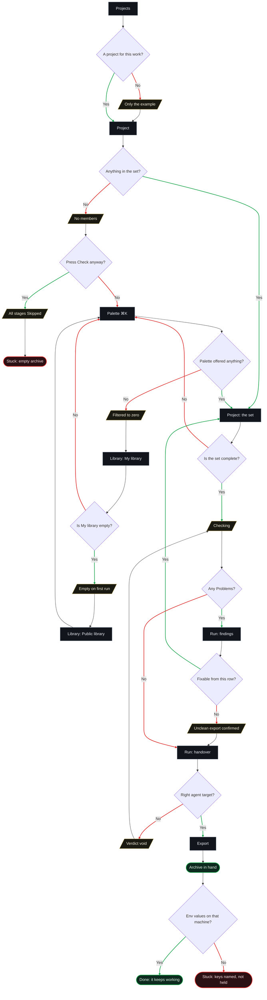
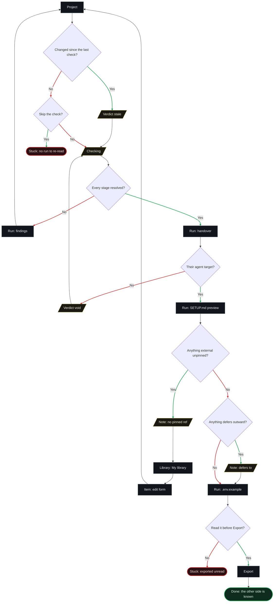
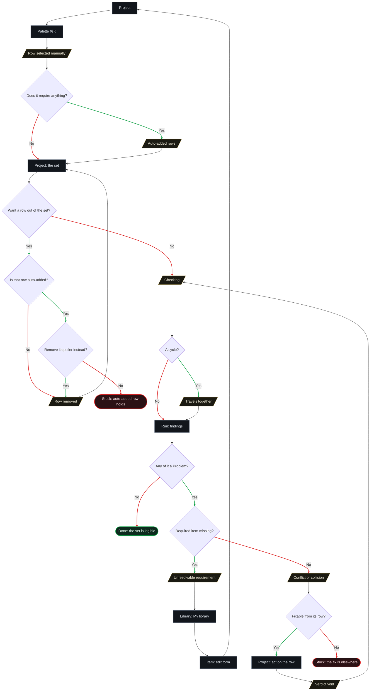
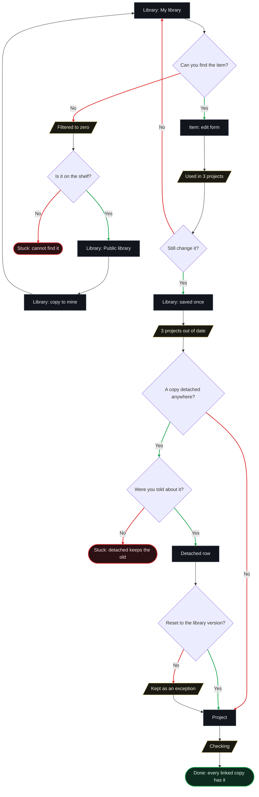
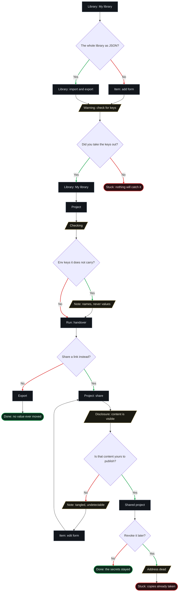

# User flows — lesson 03, information architecture

> **Written 2026-09-16, out of [`sitemap.md`](sitemap.md) and nothing else.** Every screen node in
> these diagrams is a screen, mode, overlay or state that section already established. **No new screen
> was invented, and none was needed** — which is the first thing the exercise was meant to test.
>
> **Five flows: the main job, and four related ones.** Each is drawn from
> [`jtbd.md`](../research/7-jobs-to-be-done/jtbd.md), named with the job's own wording rather than with
> a feature name, and each ends in **both** kinds of ending — the one where the person is done, and the
> ones where they are stuck.

**How to read the shapes.**

| Shape | Meaning |
|---|---|
| `[ rectangle ]` | **A screen, mode or overlay** — the name is the one [`sitemap.md`](sitemap.md) uses |
| `[/ parallelogram /]` | **A state** of one of those — empty, checking, filtered to zero, stale, void |
| `{ diamond }` | **A decision**, always a yes/no question. **The green branch is *yes*, the red branch is *no*** |
| `([ stadium ])` | **An ending.** `Done:` the job is closed · `Stuck:` a dead end |

**Node labels are names, not sentences.** *Corrected 2026-09-16: the first version carried labels of up
to 95 characters, which sprawls a `TD` flowchart sideways until it stops being readable.* **The diagram
carries the shape; the numbered list under it carries the argument.** Every node is keyed to a line in
that list.

**One thing the colours do not mean.** A red branch is not a failure and a green one is not a success —
*no* is often the right answer. The colour marks **which way the question was answered**, and the
ending nodes are where success and dead ends are distinguished.

---

## The main job — "when something I have already got working has to live somewhere else, I want it to keep working there"

[The main job](../research/7-jobs-to-be-done/jtbd.md#the-main-job) · **P1**, primary · `✓` + `*`, and
the loudest number in the evidence base sits inside it.

**The decisions, in words.**

1. **A project for this work?** — the only fork at the top, and it is why `Projects` is the first screen
   on a first run rather than `Library` (§Navigation).
2. **Anything in the set?** — the state nobody designs for, and the one that produces the product's
   emptiest possible result.
3. **Press Check anyway?** — a real branch, because nothing blocks: the button is live on an empty set
   exactly as it is on a full one.
4. **Palette offered anything?** — the palette is *the only way the library reaches this screen* (§8),
   so a cold palette is a wall and not an inconvenience.
5. **Is My library empty?** — §11 guarantees it is, on first run. The way out is the `Public library`
   scope, which is why the shelf exists at all.
6. **Is the set complete?** — the loop back into the palette, and where this product's real depth lives:
   **selection, not traversal.**
7. **Any Problems?** — three severities, and none of them blocks.
8. **Fixable from this row?** — §8 says a finding annotates the row that owns it. When the fix is four
   items away this is a *no*, and the unclean export is the honest route.
9. **Right agent target?** — changing it **voids the verdict** (§6), because a path collision is a
   collision *under a target*.
10. **Env values on that machine?** — the product's ceiling, drawn as a decision it does not get to
    make.

**The states, in words.** *Projects holding only the example* · *a project with no members* · *every
stage Skipped, on its own neutral glyph* · *the palette filtered to zero* · *`My library` empty on first
run* · *the check in progress* · *the unclean-export confirmation, in the row below the finding that
caused it* · *the verdict voided by a target change*.

**Where a person gets stuck.** **The empty archive** — they checked a set with nothing in it, got a
column of neutral glyphs, and exported a zip that teaches nothing. **The env values on the other side**
— the archive is correct, `.env.example` names the keys, and the product has nothing to give them
because `needsEnv` holds names and never values. That second one is the main job's own ceiling:
**checked, never works.**

---

## RJ-1 — "know what the other side will still need, before I send it"

[RJ-1](../research/7-jobs-to-be-done/jtbd.md#rj-1--know-what-the-other-side-will-still-need-before-i-send-it)
· **P1** sending, **P2** receiving · importance **`[?]`** for the primary — the cell was withdrawn by
the audit and hunted for twice since.

**The decisions, in words.**

1. **Changed since the last check?** — six events void a verdict (§6), and one of them is an edit to an
   item the person never touched because `requires` pulled it in.
2. **Skip the check?** — there is nothing to skip to: the verdict survives as counts and a date, the
   findings do not, and **the handover stages exist only inside a run.**
3. **Every stage resolved?** — findings come before the handover; an unresolvable requirement is read on
   the project, not in the disclosure.
4. **Their agent target?** — it selects the paths **and the reader**, since `SETUP.md` is addressed to
   an agent.
5. **Anything external unpinned?** — a Note, and the one the handover test proved load-bearing: the
   receiving agent used the pins to fetch back both items the archive had lost.
6. **Anything defers outward?** — Q10's Note, carried to the receiver because **the receiver is the
   person whose linter it is going to be.**
7. **Read it before Export?** — the whole job in one question.

**The states, in words.** *A stale verdict naming what voided it* · *the check in progress* · *the
verdict voided by a target change* · *an external item with no pinned `ref`* · *a deference Note that
never clears*.

**Where a person gets stuck.** **Skipping the check** — because no run is stored, there is no page where
last week's handover can be re-read; re-reading means checking again, and a person who does not know
that will look for a link that does not exist. **Exporting unread** — the disclosure was placed before
the irreversible step precisely so this could not happen quietly, and the flow draws it as reachable
anyway, because nothing blocks.

---

## RJ-2 — "find out what my pieces drag in, and where two of them will fight, while I can still act"

[RJ-2](../research/7-jobs-to-be-done/jtbd.md#rj-2--find-out-what-my-pieces-drag-in-and-where-two-of-them-will-fight-while-i-can-still-act)
· **P1** · importance **3**, and `✓` that **nothing on the market has this object at all**: four skill
managers were run against a deliberately broken set and none saw a set-level defect.

**The decisions, in words.** *Redrawn 2026-09-16: the first version mixed the two moments — it asked
about **check findings** on the Project screen, before and after the run. Every Problem in §6 is
produced by the check and nowhere else, and the flow now says so.*

1. **Does it require anything?** — the depth-first walk, run the moment the item is added. Auto-added
   rows appear on the Project screen **with no check involved**, each naming what pulled it in.
2. **Want a row out of the set?** — the removal branch, and the only place in the entire specification
   where the product refuses an action.
3. **Is that row auto-added?** and **remove its puller instead?** — the refusal has a shape worth
   drawing: **you do not remove the dependency, you remove what dragged it in.**
4. **A cycle?** — **not an error.** A project is a set and never an execution order, so the answer is
   *these three always travel together*, reported as information.
5. **Any of it a Problem?** — the only place the word appears, because **the check is the only thing
   that produces one.**
6. **Required item missing?** — an unresolvable requirement, whose fix leaves this flow entirely: you go
   and author the missing item, and come back to a set that has changed.
7. **Fixable from its row?** — §8 says a finding annotates its own row. When it can be acted on the set
   changes and **the verdict is void**, which is why the loop goes back **through** the check rather
   than around it.

**The states, in words.** *A row selected manually* · *auto-added rows naming what pulled them in* · *a
row removed* · *the check in progress* · *a cycle reported as information* · *an unresolvable
requirement* · *a declared conflict, a duplicate command name or a target-path collision* · *the verdict
voided because the set changed*.

**Where a person gets stuck.** **The auto-added row that will not go** — the product's one refusal, and
the dead end is real: if it does not occur to you to remove the puller instead, there is no other way
out. **The Problem you cannot reach from here** — the fix is four items away or in another project, and
the archive will carry only one of the two, which is correct behaviour and still a bad afternoon.

---

## RJ-3 — "fix something once and have the fix reach every copy of it"

[RJ-3](../research/7-jobs-to-be-done/jtbd.md#rj-3--fix-something-once-and-have-the-fix-reach-every-copy-of-it)
· **P1** · importance **3** · `✓` that copies drift and **stay** drifted: 14% of 7,506 duplicated items
out of sync now, 383 divergences open at a median of 121 days, four ever reconciled.

**The decisions, in words.**

1. **Can you find the item?** — H-J1, importance **2**, and the thinnest evidence behind any screen in
   the product.
2. **Is it on the shelf?** — the `Public library` scope is read-only: you copy it into `My library` and
   own the copy from then on, which is the only way to make it fixable.
3. **Still change it?** — the blast radius is disclosed **before any field is editable**, which is where
   it had to go once `Item` stayed a form rather than becoming a place.
4. **A copy detached anywhere?** — the exception `detached` and `overrides` exist for.
5. **Were you told about it?** — the honest question, and today's answer is **no**: the Library row does
   not say it. *Recorded open on E14 and E5 in [`sitemap.md`](sitemap.md).*
6. **Reset to the library version?** — a *no* is legitimate: the override was the point, and the row
   names the fields that differ.

**The states, in words.** *The Library filtered to zero* · *the blast radius at the head of the form* ·
*every holding project reading as out of date* · *a detached row kept deliberately, with its differing
fields named* · *the check in progress*.

**Where a person gets stuck.** **The item they cannot find** — nothing in this product prompts a review
of the corpus, which the practitioner on record says plainly: *"I basically never go in there to read or
review."* **The detached copy nobody mentioned** — the fix reaches every **linked** copy and by design
skips the detached one, and this flow is where that design decision becomes a person discovering it
weeks later. **It is the sharpest thing these five diagrams found.**

---

## RJ-4 — "move my work without moving my secrets or my client's business with it"

[RJ-4](../research/7-jobs-to-be-done/jtbd.md#rj-4--move-my-work-without-moving-my-secrets-or-my-clients-business-with-it)
· **P1** and **P2** · `✓`, the largest crowd on a fear after the multi-target family — 192, 54, 45, 32,
23, 22 across three trackers.

**The decisions, in words.**

1. **The whole library as JSON?** — both answers land on the same warning, which is the point: **the
   library has exactly one way in, so there is exactly one place to say this.** *Yes* is the orphan —
   §10 commits to JSON import and export and **no job raises it.**
2. **Did you take the keys out?** — **asked of the person, never answered by the product.** This is the
   decision that used to be a refusal and became a warning on 2026-09-16: detection was the part that
   could not be built, and a block standing on a scan we do not trust stops the file that was fine.
3. **Env keys it does not carry?** — a Note, and the strongest guarantee in the product sits under it:
   `needsEnv` holds **names and never values**, so there is structurally no value to leak.
4. **Share a link instead?** — the two exits, and until 2026-09-16 only one of them was ever going to be
   checked.
5. **Is that content yours to publish?** — the tangled case a practitioner actually described: a
   client's internal API shape in an example, a rule naming a client, an env key whose own **name**
   names a customer. **We cannot detect these and must not pretend to.**
6. **Revoke it later?** — a real branch with an ending that is not a success.

**The states, in words.** *The warning where material comes in* · *the check in progress* · *missing env
names as a Note* · *the sharing disclosure* · *the tangled-content Note* · *a revoked address*.

**Where a person gets stuck.** **The key they left in** — nothing in this product will catch it, and the
flow says so out loud rather than drawing a scanner that does not exist. **The link they revoked** — the
address dies and every copy already taken lives on, which the product must state **at the moment of
revoking** rather than implying a recall.

---

## What these five flows did to the sitemap

**Nothing, and that is the result worth recording.** Every node above is a screen, mode, overlay or
state that [`sitemap.md`](sitemap.md) had already established — **no new screen appeared, in five flows
covering the main job and four related ones.** An information architecture that needs a new place the
moment somebody walks a real path through it is an architecture that was drawn from a product rather
than from jobs.

**Three things the flows surfaced that the static map did not, and each is a consequence rather than a
gap.**

1. **The detached copy nobody is told about** (RJ-3). *Fix it once and have the fix reach every copy* is
   importance **3**, and a detached row is **by design** not reached. The Library row that says *used in
   3 projects* does not say *and one of them will not get this.* **The mechanism is correct and the
   disclosure is missing**, which is a step 5 question about what the form's head says, not a change to
   §5.
2. **The empty set that checks clean** (main job). A project with no members produces a column of
   Skipped and an archive containing nothing. §6 gave *Skipped* its own neutral glyph for exactly this
   honesty, and the flow shows the one path where neutral glyphs all the way down is still a wasted
   afternoon.
3. **Two of the eight dead ends are outside the product** (the env values on the receiving machine, the
   revoked link's copies). **Neither is a defect and neither can be designed away** — they are the shape
   of *checked, never works* and of *revoking recalls nothing*, drawn so that step 5 writes sentences
   for them instead of discovering them.
